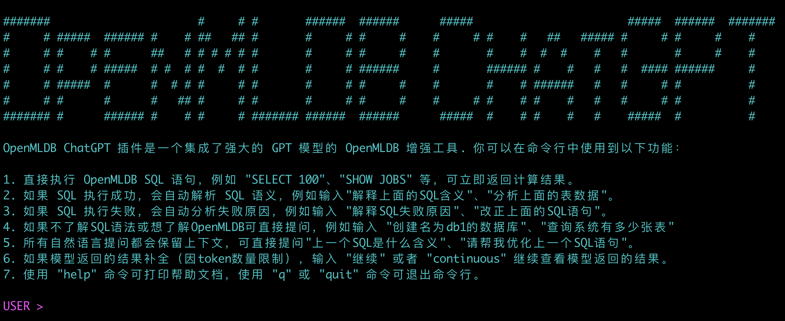
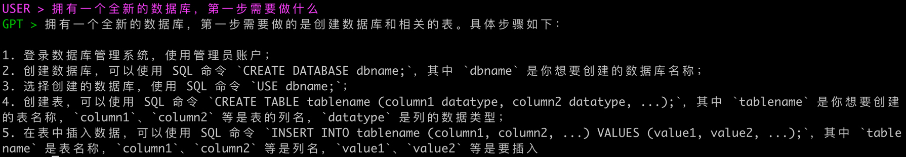
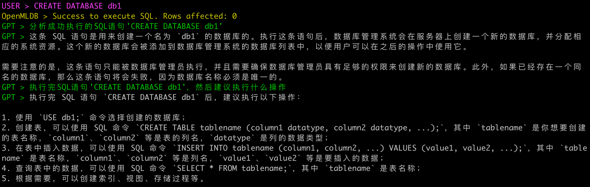
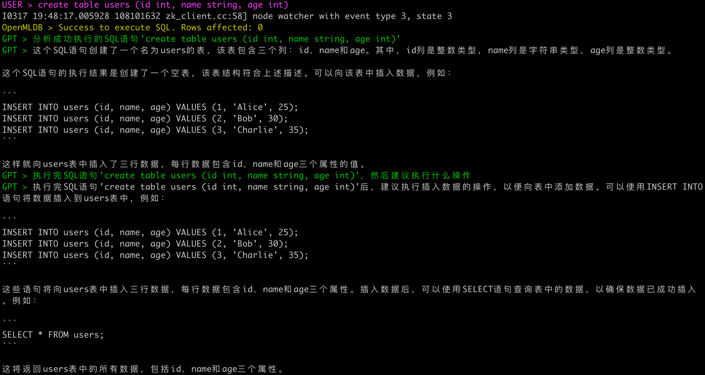
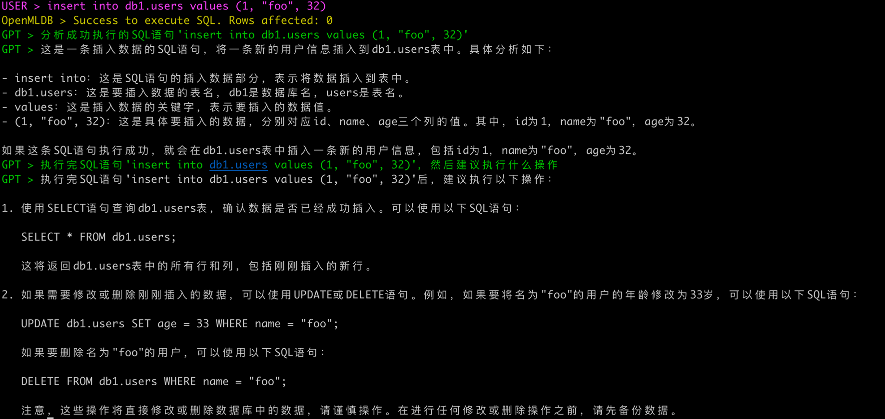
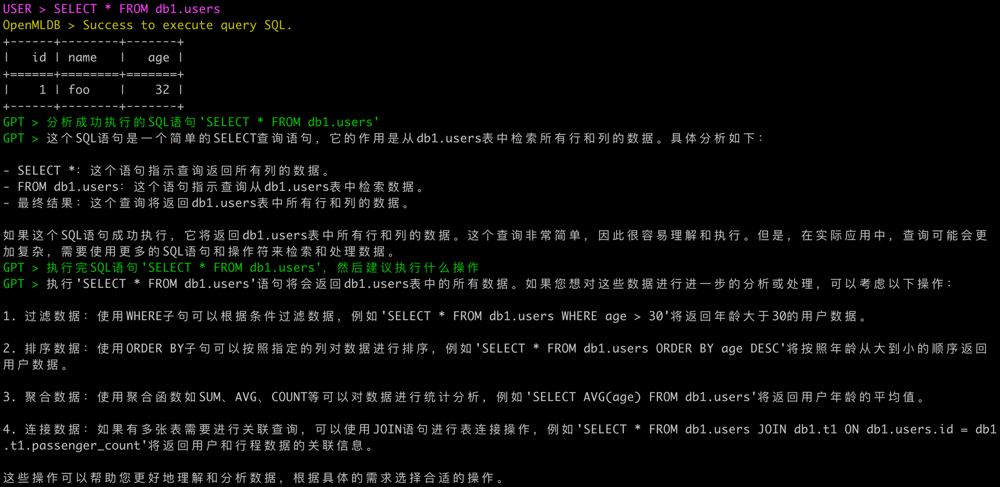
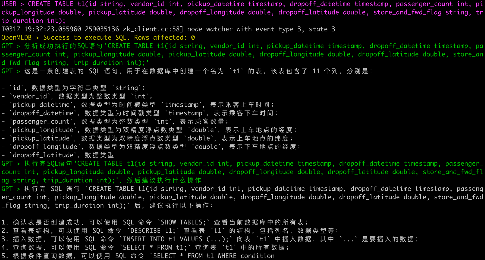
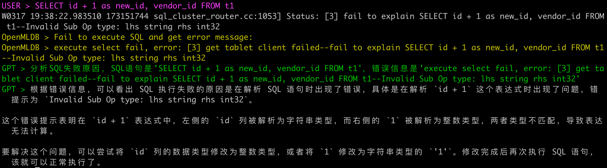
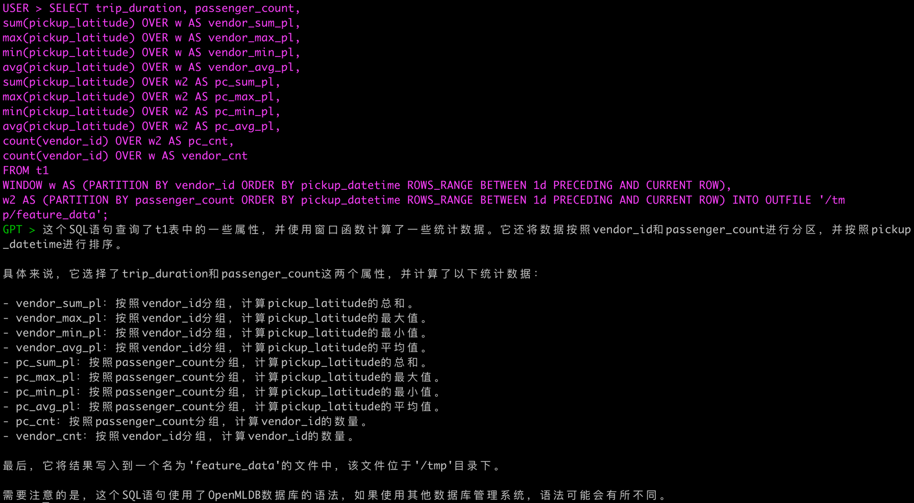
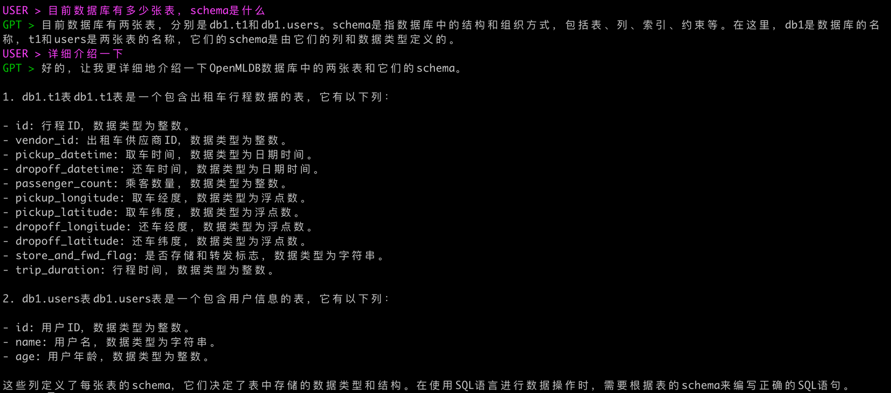

# OpenMLDB ChatGPT Plugin

The ChatGPT plugin to enhance OpenMLDB. Here are the features:

* Integrate **GPT models** with OpenMLDB service
* Automatically **generate SQL** and **correct SQL**
* Enable to update database with **chat interface**
* New using experience of database with **AI prompts**

## Install

Install with [python package](https://pypi.org/project/openmldb-chatgpt/).

```
pip install openmldb-chatgpt
```

Use pre-built docker image (OpenMLDB included).

```
docker run -it tobegit3hub/openmldb-chatgpt
```

## Usage

Install [OpenMLDB](https://github.com/4paradigm/OpenMLDB) with [PortableOpenMLDB](https://github.com/tobegit3hub/PortableOpenMLDB). No need to install for docker container.

Register [OpenAI account](https://openai.com) and get the API key. Make sure you can access the OpenAI API.

Run `openmldb-chatgpt` to connect with OpenMLDB and use OpenAI API key.



## Prompts

For beginners, AI model can teach you how to use OpenMLDB and database.





All the SQL will be executed in OpenMLDB and explained by AI model.







If you create a little more complicated table, AI model will try to understand the meaning with your input. 



For senior SQL users, AI model can help to debug and correct your SQL.



AI model can help to analyse the complex SQL and explain it in natural language as well.



You can ask AI model to show more info about OpenMLDB cluster without writing specified SQL.



**Please try by yourself and discover more magic functions with the powerful AI model and OpenMLDB!** 
